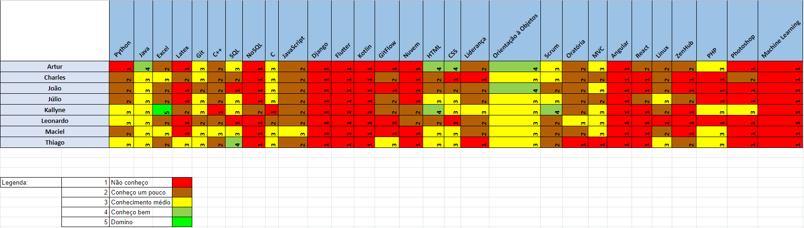

# Review

## 1. Visão Geral
<!-- data de inicio da sprint
     data de finalização da sprint
     duraração da sprint
 -->
Início | Fim | Duração
------ | --- | -------
14/06 | 21/06 | 7 dias

## 2. Conclusão
<!-- adicionar a issue, sua descrição, o responsavel e se a issue foi terminada ou não -->
Issues | Descrição | Resposáveis | Status
------ | --------- | ----------- | ------
01 | Documentar Sprint 00 | [Júlio](https://github.com/Julio-eng) | Completa
02 | Template da Issue | [Artur](https://github.com/artur-seppa) | Completa
03 | Aplicação do ZenHub | [Thiago](https://github.com/Thiago-Cerq) | Completa
04 | Estudo de Documento de Arquitetura | [Leonardo](https://github.com/Leonardo0o0) e [Kallyne](https://github.com/kazpmcd/) | Completa
05 | Treinamento Git/GitHub | Toda a equipe | Completa
06 | Estudo de Documento de Visão | [Charles](https://github.com/charles-serafim) e [Maciel](https://github.com/macieljuniormax) | Completa
07 | Estudar sobre o GitHub Pages | [Júlio](https://github.com/Julio-eng) e [Charles](https://github.com/charles-serafim) | Completa
08 | Documentar Sprint 01 | [João](https://github.com/JoaoSchmitz) | Completa
09 | Visualizar trabalhos de grupos anteriores | Toda a equipe | Completa

## 3. FeedBack
<!--
Pontos positivos e negativos da Sprint
-->
### _Pontos Positivos_
* Houve um bom entendimento entre os membros da equipe.
* As issues foram boas escolhas para o estágio atual do projeto.
* Equipe comunicativa, mesmo sem um objetico claro.
### _Pontos de Melhoria_
* Algumas reuniões propostas no Scrum não foram realizadas devido ao processo de organização estar no estágio inicial.
* Reuniões com horários definidos em cima da hora.
### _Pontos Negativos_
* A falta da disponibilização do tema do projeto só permitiu a realização de atividades mais gerais.
* Falta de gráficos como o Burndown Report e Velocity Tracking.

## 4. Quadro de Conhecimento
<!-- Adicionar o quadro de conhecimentos atualizados da equipe -->
