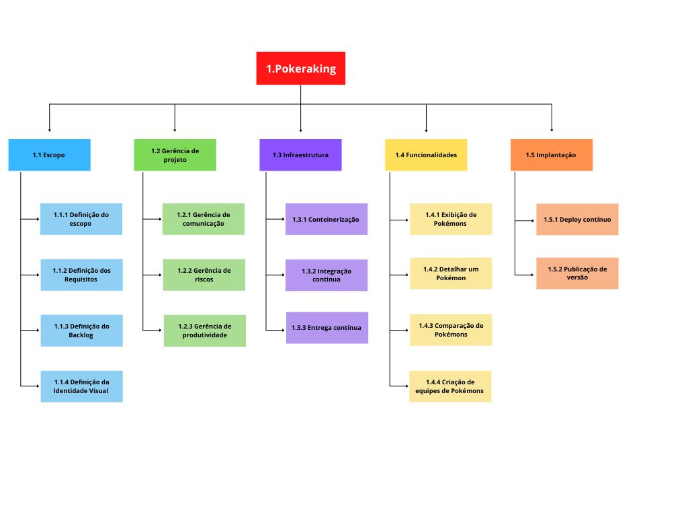

# Estrutura Analítica do Projeto

## Histórico de Versão

| Data       | Versão | Descrição                                         | Autor                                               |
| ---------- | ------ | ------------------------------------------------- | --------------------------------------------------- |
| 26/07/2022 | 0.1    | Primeira versão da estrutura analítica do projeto | [Maciel Júnior](https://github.com/macieljuniormax) |

## 1. Introdução

Este documento tem como objetivo facilitar a visualização do escopo do projeto afim de auxiliar no gerenciamento das entregas.

## 2. Diagrama

