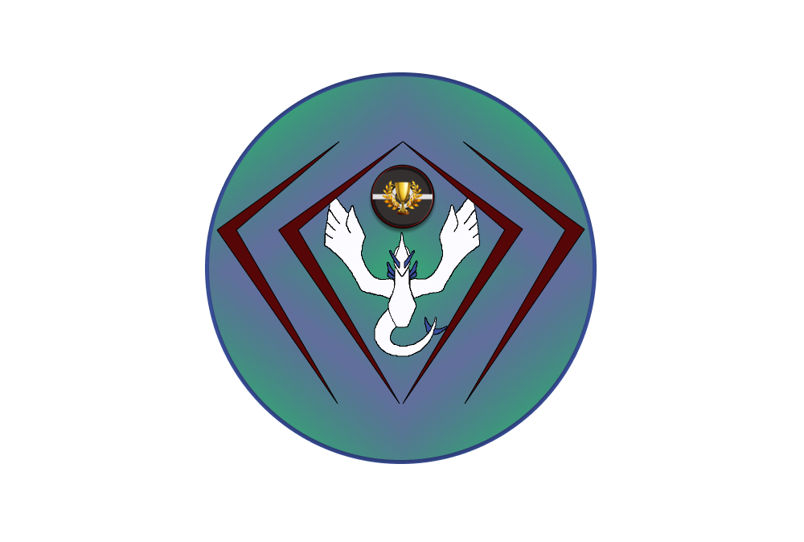
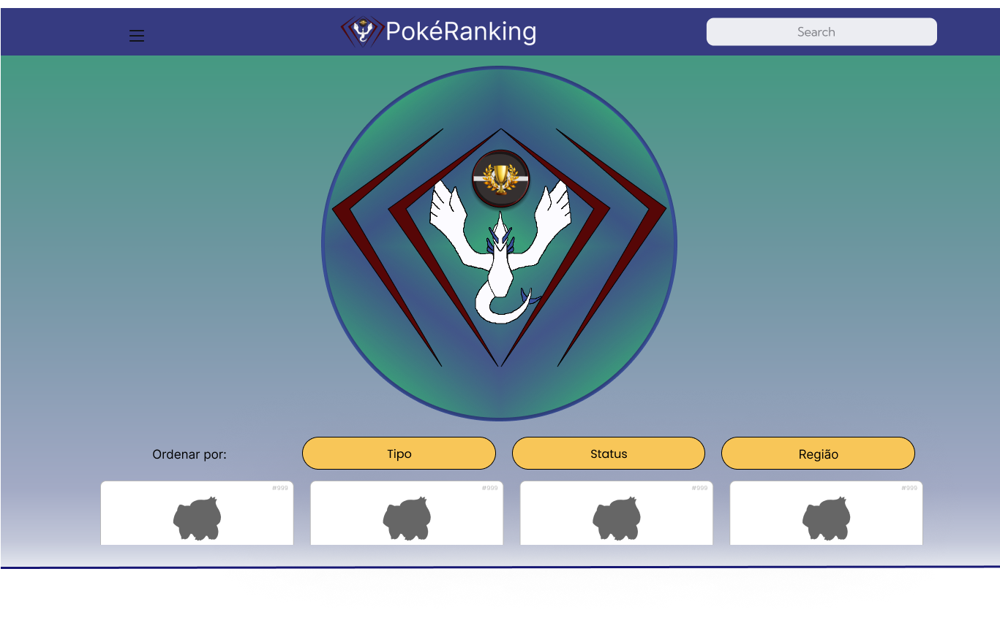
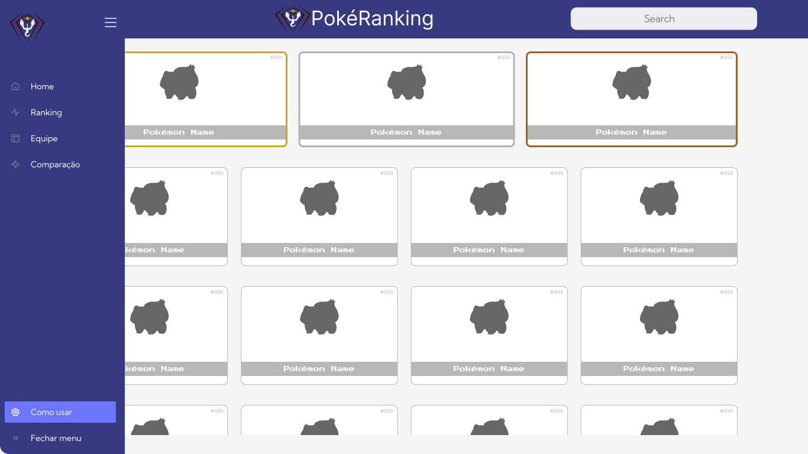
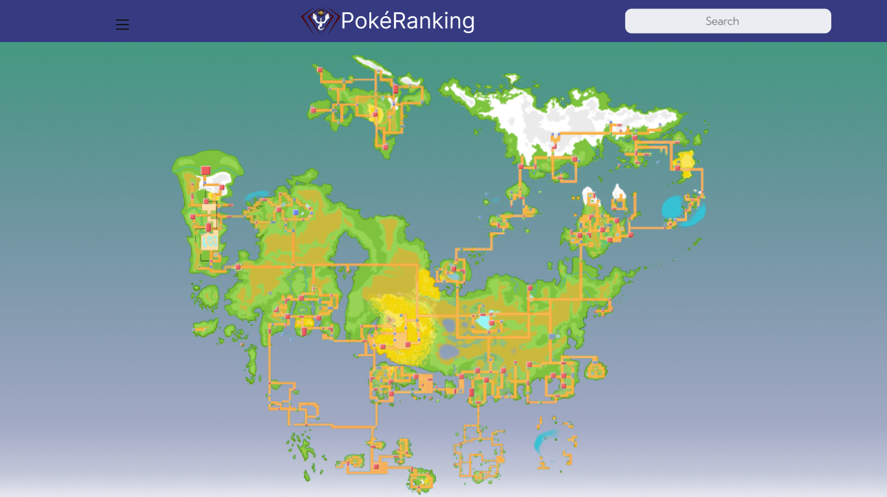
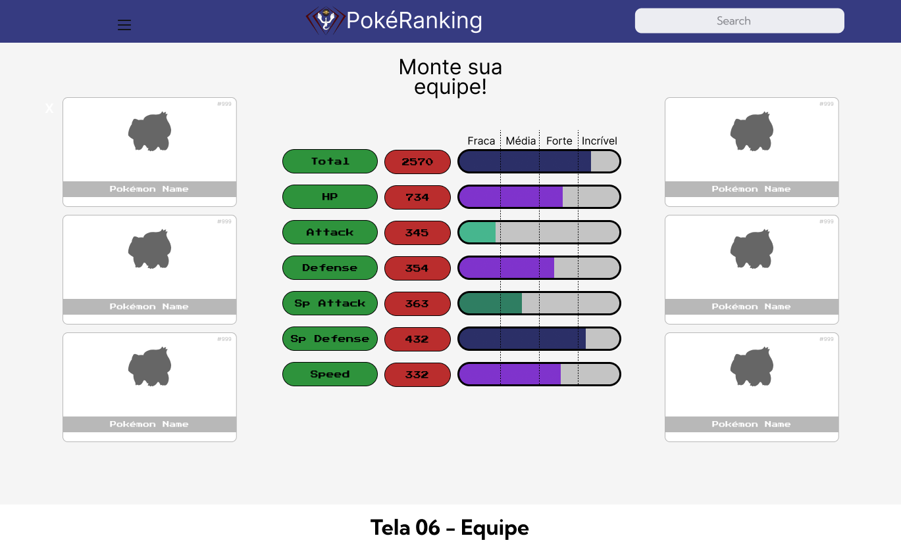
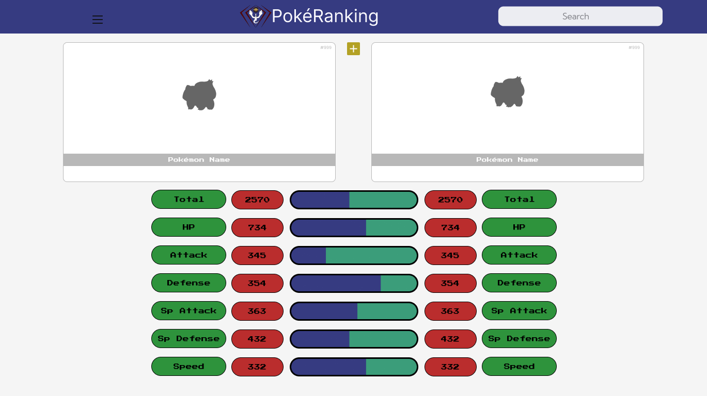
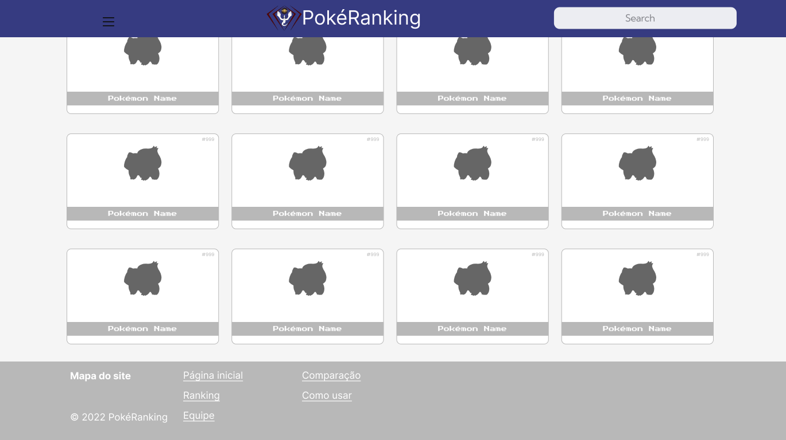

# Logotipo

# Telas

<iframe style="border: 1px solid rgba(0, 0, 0, 0.1);" width="800" height="450" src="https://www.figma.com/embed?embed_host=share&url=https%3A%2F%2Fwww.figma.com%2Ffile%2FVhLtYknSnVjdPi0RTfaJ6E%2FPok%25C3%25A9Ranking%3Fnode-id%3D0%253A1" allowfullscreen></iframe>
