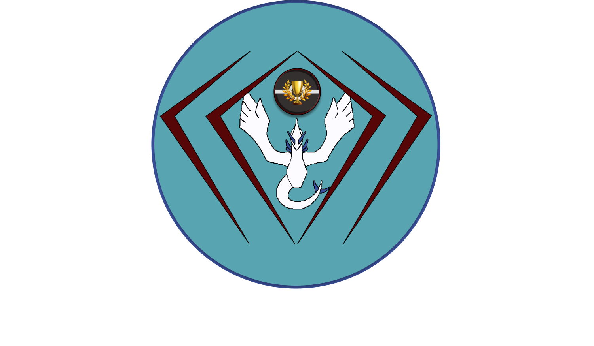
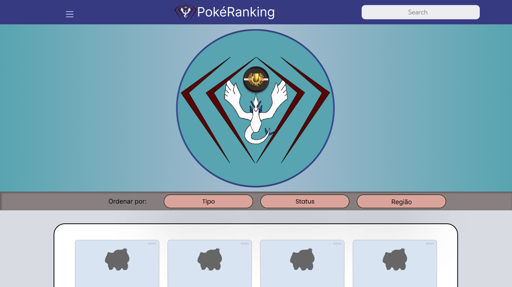
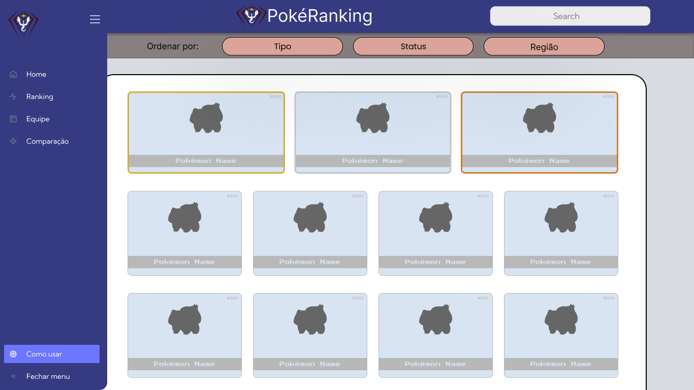
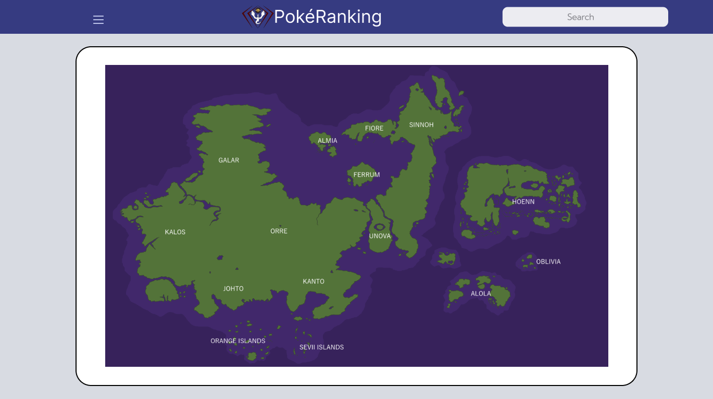
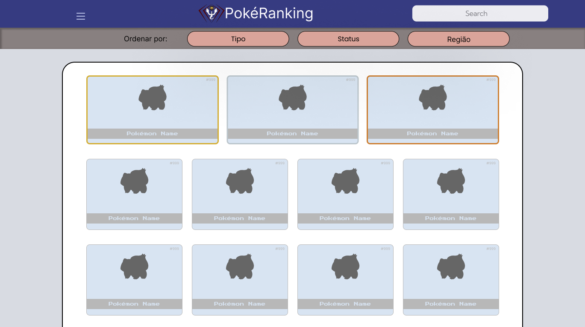
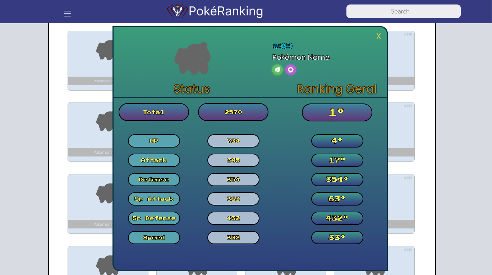
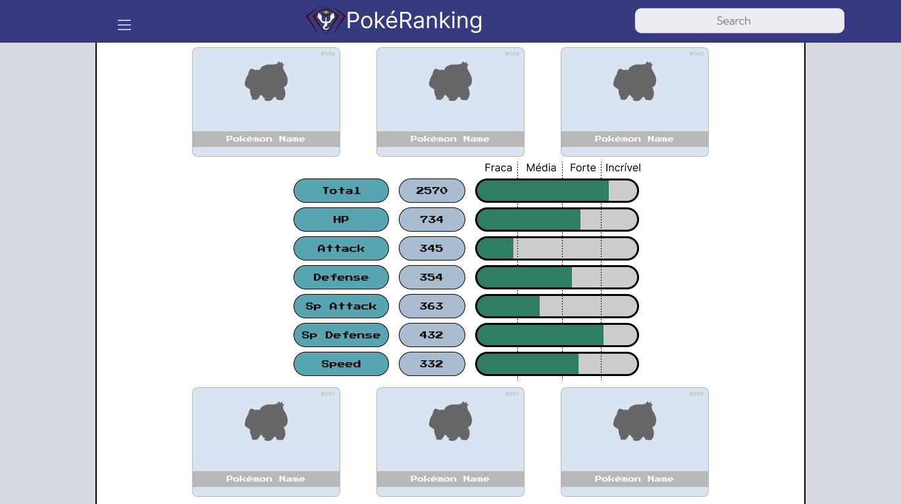

## Histórico de Revisão

| Data | Versão | Descrição | Autor(es) |
|:----------:|:--------:|:----------------------:|:---------------------------:|
02/08/2022 | 1.0 | Versão inicial para Release 1 | [Artur](https://github.com/artur-seppa)
14/09/2022 | 2.0 | Versão final para Release 2 | [João Matheus](https://github.com/JoaoSchmitz)

# Logotipo

# Telas

<iframe style="border: 1px solid rgba(0, 0, 0, 0.1);" width="800" height="450" src="https://www.figma.com/embed?embed_host=share&url=https%3A%2F%2Fwww.figma.com%2Ffile%2FVhLtYknSnVjdPi0RTfaJ6E%2FPok%25C3%25A9Ranking%3Fnode-id%3D0%253A1" allowfullscreen></iframe>
