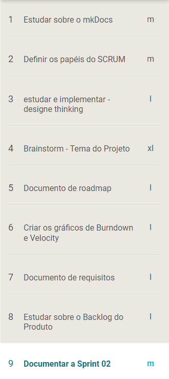
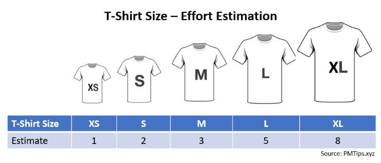

# Review

## 1. Visão Geral
<!-- data de inicio da sprint
     data de finalização da sprint
     duraração da sprint
 -->
Início | Fim | Duração
------ | --- | -------
21/06| 28/06 | 7 dias

## 2. Conclusão
<!-- adicionar a issue, sua descrição, o responsavel e se a issue foi terminada ou não -->
Issues | Descrição | Resposáveis | Status
------ | --------- | ----------- | ------
01 | Estudo e implementação do MkDocs no GitHub Pages | [Julio](https://github.com/Julio-eng) e [Charles](https://github.com/charles-serafim) | Incompleta
02 | Documentar a Sprint 02 | [Artur](https://github.com/artur-seppa) | Completa
03 | Definir os papéis do SCRUM | Toda a equipe | Completa
04 | Estudar e implementar o Design Thinking | [Kallyne](https://github.com/kazpmcd/) | Completa
05 | Estudar sobre o Backlog do Produto | [Leonardo](https://github.com/Leonardo0o0) | Completa
06 | Estudar sobre o documento de requisitos | [Maciel](https://github.com/macieljuniormax) | Completa
07 | Estudar sobre documento de roadmap | [João](https://github.com/JoaoSchmitz) | Completa
08 | Criar os gráficos de Burndown e Velocity | [Thiago](https://github.com/Thiago-Cerq) | Completa
09 | Definir o tema de projeto | Toda a equipe | Completa

## 3. FeedBack
<!--
Pontos positivos e negativos da Sprint
-->
### _Pontos Positivos_
* Houve um bom entendimento entre os membros da equipe.
* As issues foram boas escolhas para o estágio atual do projeto.
* A equipe foi comunicativa durante o decorrer da sprint.
* O time buscou se organizar da melhor forma para realizar todas as reuniões propostas pelo SCRUM.

### _Pontos de Melhoria_
* Buscar não iniciar as reuniões da sprint com atraso.

### _Pontos Negativos_
* A entrega do tema de projeto foi feita quase na hora do deadline.

## 4. Planning Poker das Issues
<!-- Adicionar o quadro de conhecimentos atualizados da equipe -->

## 5. Padrão de estimativa de complexidade da issue
<!-- Adicionar o quadro de conhecimentos atualizados da equipe -->
