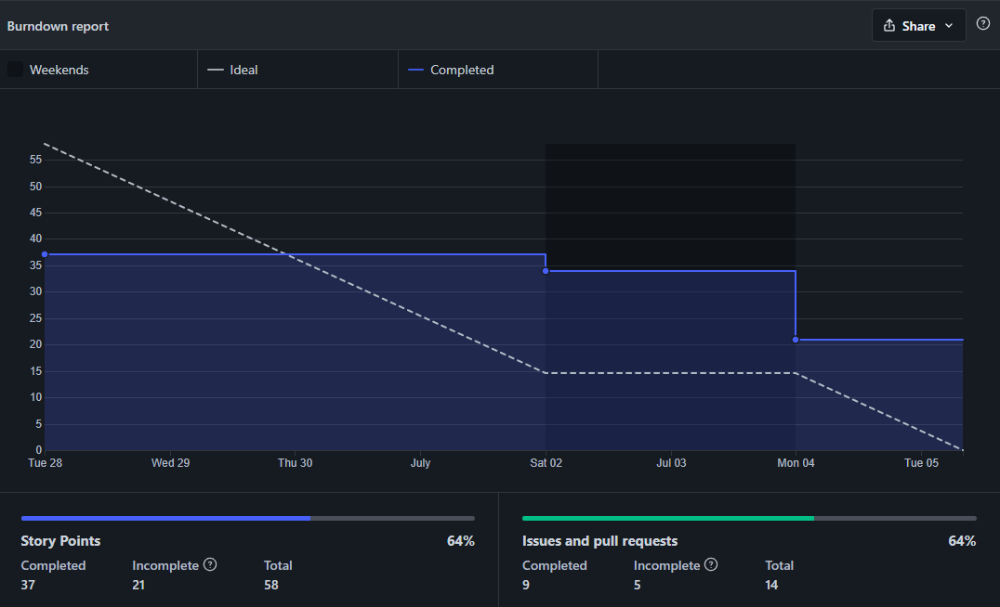

# Review

## 1. Visão Geral
<!-- data de inicio da sprint
     data de finalização da sprint
     duraração da sprint
 -->
Início | Fim | Duração
------ | --- | -------
28/06 | 05/07 | 7 dias

---------

## 2. Conclusão
<!-- adicionar a issue, sua descrição, o responsavel e se a issue foi terminada ou não -->
Issues | Descrição | Resposáveis | Status
------ | --------- | ----------- | ------
01 | Atualizar o Documento de Visão | [Artur](https://github.com/artur-seppa) | Completa
02 | Estudar o Protótipo de Baixa Fidelidade | [Maciel](https://github.com/macieljuniormax) | Completa
03 | Levantar o Git Pages | [Julio](https://github.com/Julio-eng) e [Charles](https://github.com/charles-serafim) | Completa
04 | Definir os requisitos | Toda a equipe | Completa
05 | Definir o template do Backlog do Produto | [Leonardo](https://github.com/Leonardo0o0) | Completa
06 | Definir as tecnologias | Toda a equipe | Completa
07 | Adicionar Código de Conduta | [Kallyne](https://github.com/kazpmcd/) | Completa
08 | Documentar a Sprint 03 | [João](https://github.com/JoaoSchmitz) | Completa

---------

## 3. FeedBack
<!--
Pontos positivos e negativos da Sprint
-->
### _Pontos Positivos_
* Houve um bom entendimento entre os membros da equipe.
* As issues foram boas escolhas para o estágio atual do projeto.
* As tecnologias e requisitos iniciais foram decididos sem complicações.
* A equipe foi comunicativa durante o decorrer da sprint.
* O time buscou se organizar da melhor forma para realizar todas as reuniões propostas pelo SCRUM.

### _Pontos de Melhoria_
* Buscar não iniciar as reuniões da sprint com atraso.
* Buscar a presença de todos os membros durante as reuniões.

### _Pontos Negativos_
* A criação das issues no GitHub ocorreu tardiamente.
* Algumas issues não estão sendo editas de modo total, podendo prejudicar os gráficos de BurnDown e Velocity.

---------

## 4. Tecnologias e Requisitos definidos

---------

## 5. Gráfico - BurnDown

---------

## 6. Gráfico - Velocity

