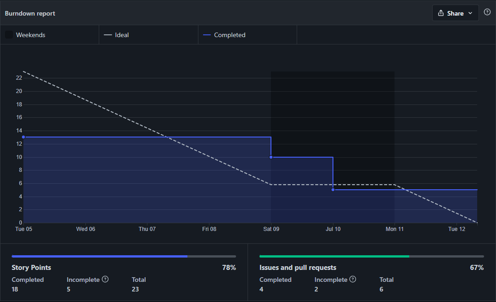
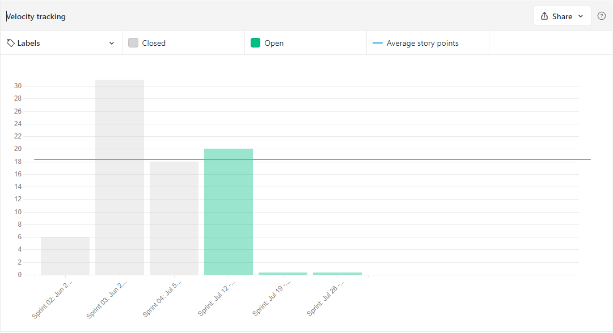

# Review

## 1. Visão Geral
<!-- data de inicio da sprint
     data de finalização da sprint
     duraração da sprint
 -->
Início | Fim | Duração
------ | --- | -------
05/07 | 12/07 | 7 dias

## 2. Conclusão
<!-- adicionar a issue, sua descrição, o responsavel e se a issue foi terminada ou não -->
Issues | Descrição | Responsáveis
------ | --------- | -----------
01 | Documentar Sprint 04 | [Charles](https://github.com/charles-serafim) | Completa
02 | Atualizar o documento de Arquitetura | [Leonardo](https://github.com/Leonardo0o0) | Completa
03 | Definir o Backlog do Produto | Toda a equipe | Completa
04 | Protótipo de baixa fidelidade | [Thiago](https://github.com/Thiago-Cerq) | Completa
05 | Estudo do parser | [Kallyne](https://github.com/kazpmcd/) e [João](https://github.com/JoaoSchmitz) | A continuar durante os próximos ciclos
06 | Estudo de tecnologias front-end | [Thiago](https://github.com/Thiago-Cerq), [Charles](https://github.com/charles-serafim), [Julio](https://github.com/Julio-eng) e [Leonardo](https://github.com/Leonardo0o0) | A continuar durante os próximos ciclos
07 | Estudo de tecnologias back-end | [Maciel](https://github.com/macieljuniormax), [Kallyne](https://github.com/kazpmcd/), [João](https://github.com/JoaoSchmitz) e [Artur](https://github.com/artur-seppa) | A continuar durante os próximos ciclos
08 | Estudo e testes da API | [Artur](https://github.com/artur-seppa) e [Maciel](https://github.com/macieljuniormax) | A continuar durante os próximos ciclos

## 3. FeedBack
<!--
Pontos positivos e negativos da Sprint
-->
### _Pontos Positivos_
* O time avançou na aplicação das metodologias ágeis, conseguindo se organizar melhor em relação ao cronograma de reuniões
* Houveram avanços significativos no andamento do projeto através da definição dos requisitos

### _Pontos de Melhoria_
* Realizar planejamento de pautas para as reuniões com antecedência, para uma melhor produtividade e aproveitamento nas reuniões
* Melhorar a forma de dividir tarefas longas entre issues, a exemplo de issues de estudo, que são contínuas durante as fases do projeto

### _Pontos Negativos_
* As issues de estudo acabaram por se alongar para além do ciclo da Sprint, pois são processos contínuos e de conteúdo extenso
---------

## 4. Backlog do Produto
O Backlog do Produto pode ser visualizado neste [link](https://github.com/fga-eps-mds/2022-1-PokeRanking/blob/main/docs/Documenta%C3%A7%C3%A3o/product-backlog.md)

---------

## 5. Gráfico - BurnDown

---------

## 6. Gráfico - Velocity

