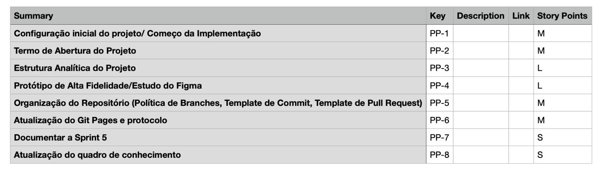

# 1. Planning

## 1.1. Visão Geral
<!-- data de inicio da sprint
     data de finalização da sprint
     duraração da sprint
 -->
 Início | Fim | Duração
 ------ | --- | -------
 12/07 | 19/07 | 7 dias

## 1.2. Papéis
<!-- Papeis que cada membro exerceu durante essa sprint -->

<table>
  <tr>
    <th align="center">Papel</th>
    <th align="center">Membros</th>
  </tr>

  <tr align="center">
    <td rowspan="2">Product Owner</td>
    <td>Charles Serafim Morais</td>
    <tr align="center">
        <td>Júlio César</td>
    </tr>
  </tr>

  <tr align="center">
    <td rowspan="2">Scrum Master</td>
    <td>Thiago Borges</td>
    <tr align="center">
        <td>Joao Schmitz</td>
    </tr>
  </tr>

  <tr align="center">
    <td rowspan="2">Arquiteto de software</td>
    <td>Kallyne</td>
    <tr align="center">
        <td>Leonardo</td>
    </tr>
  </tr>

  <tr align="center">
    <td rowspan="2">Desenvolvedor</td>
    <td>Artur Seppa Reiman</td>
    <tr align="center">
        <td>Maciel Júnior</td>
    </tr>
  </tr>

  
</table>

## 1.3. Objetivos da Sprint
<!-- descrever de forma geral o objetivo da sprint -->
* Inicio da implementação do que foi estudado;
* Treinamentos das tecnologias escolhidas para o desenvolvimento do produto;
* Implementação das tecnicas e ferramentas de desenvolvimento;
* Desenvolvimento do termo de abertura do projeto;
* Estrutura analítica do projeto e estudo protótipo de alta fidelidade ;

## 1.4. Issues
<!-- descrever as issues que definimos para essa sprint e alocar um responsavel por ela -->
Issues | Descrição | Responsáveis
------ | --------- | -----------
01 | Documentar Sprint 05 | [Thiago](https://github.com/Thiago-Cerq) 
02 | Configuração inicial do projeto| [Artur](https://github.com/artur-seppa)
03 | Termo de Abertura do Projeto | [Leonardo](https://github.com/Leonardo0o0)
04 | Estrutura Analítica do Projeto | [Maciel](https://github.com/macieljuniormax)
05 | Estudo do Figma / Protótipo de Alta Fidelidade | [João](https://github.com/JoaoSchmitz) e [Kallyne](https://github.com/kazpmcd/) 
06 | Organização do Repositório | [Julio](https://github.com/Julio-eng) 
07 | Atualização do Git Pages e protocolo |[Charles](https://github.com/charles-serafim) e [Julio](https://github.com/Julio-eng) 
08 | Atualização do Quadro de Conhecimentos | [Kallyne](https://github.com/kazpmcd/)
## 1.5. Planning Poker

