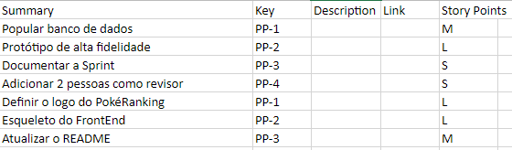

# 1. Planning

## 1.1. Visão Geral
<!-- data de inicio da sprint
     data de finalização da sprint
     duraração da sprint
 -->
 Início | Fim | Duração
 ------ | --- | -------
 19/07 | 26/07 | 7 dias

## 1.2. Papéis
<!-- Papeis que cada membro exerceu durante essa sprint -->

<table>
  <tr>
    <th align="center">Papel</th>
    <th align="center">Membros</th>
  </tr>

  <tr align="center">
    <td rowspan="2">Product Owner</td>
    <td>Charles Serafim Morais</td>
    <tr align="center">
        <td>Júlio César</td>
    </tr>
  </tr>

  <tr align="center">
    <td rowspan="2">Scrum Master</td>
    <td>Thiago Borges</td>
    <tr align="center">
        <td>Joao Schmitz</td>
    </tr>
  </tr>

  <tr align="center">
    <td rowspan="2">Arquiteto de software</td>
    <td>Kallyne Macêdo</td>
    <tr align="center">
        <td>Leonardo Sobrinho</td>
    </tr>
  </tr>

  <tr align="center">
    <td rowspan="2">Desenvolvedor</td>
    <td>Artur Seppa Reiman</td>
    <tr align="center">
        <td>Maciel Júnior</td>
    </tr>
  </tr>

  
</table>

## 1.3. Objetivos da Sprint
<!-- descrever de forma geral o objetivo da sprint -->
* Aprimoramento e implementação do que foi estudado;
* Desenvolvimento de um esqueleto do site a ser entregue;
* População e manipulação do banco de dados;
* Amadurecimento da identidade visual do projeto.
* Confecção do protótipo de alta fidelidade.

## 1.4. Issues
<!-- descrever as issues que definimos para essa sprint e alocar um responsavel por ela -->
Issues | Descrição | Responsáveis
------ | --------- | -----------
01 | Documentar Sprint 06 | [Kallyne](https://github.com/kazpmcd/) 
02 | População do banco de dados | [Artur](https://github.com/artur-seppa) e [Maciel](https://github.com/macieljuniormax)
03 | Atualização do README | [Leonardo](https://github.com/Leonardo0o0)
04 | Estrutura Analítica do Projeto | [Maciel](https://github.com/macieljuniormax)
05 | Desenvolvimento do Protótipo de Alta Fidelidade | [Kallyne](https://github.com/kazpmcd/), [João](https://github.com/JoaoSchmitz) e [Charles](https://github.com/charles-serafim)
06 | Definição da logo PokeRanking | [João](https://github.com/JoaoSchmitz)
07 | Esqueleto do FrontEnd | [Thiago](https://github.com/Thiago-Cerq), [Charles](https://github.com/charles-serafim) e [Julio](https://github.com/Julio-eng) 
08 | Adição de dois revisores | Todos 

<!-- ## 1.5. Planning Poker

[Thiago](https://github.com/Thiago-Cerq) 
[Charles](https://github.com/charles-serafim)
[Julio](https://github.com/Julio-eng) 
[Leonardo](https://github.com/Leonardo0o0)
[Kallyne](https://github.com/kazpmcd/)
[Artur](https://github.com/artur-seppa)
[Maciel](https://github.com/macieljuniormax)
[João](https://github.com/JoaoSchmitz) -->