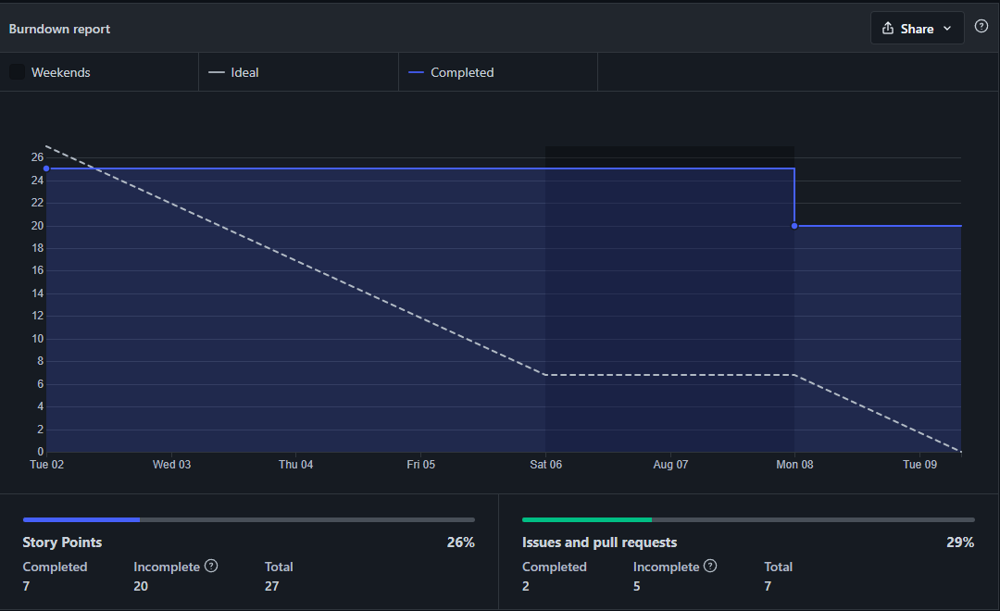
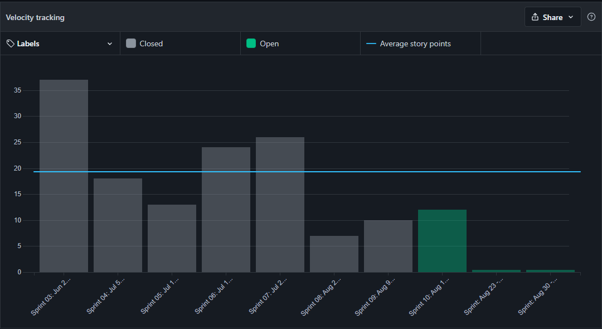

# Review

## 1. Visão Geral
<!-- data de inicio da sprint
     data de finalização da sprint
     duraração da sprint
 -->
Início | Fim | Duração
------ | --- | -------
26/07 | 02/07 | 7 dias

## 2. Conclusão
<!-- adicionar a issue, sua descrição, o responsavel e se a issue foi terminada ou não -->
Issues | Descrição | Responsáveis
------ | --------- | -----------
01 | Documentar Sprint 07 | [Thiago](https://github.com/Thiago-Cerq)
02 | Diagrama MVC do Node | [Artur](https://github.com/artur-seppa)
03 | Atualizar os gráficos nas reviews das Sprints | [João](https://github.com/JoaoSchmitz)
04 | Criar o Roadmap | [João](https://github.com/JoaoSchmitz)
05 | Atualizar o documento de arquitetura  | [Kallyne](https://github.com/kazpmcd/), e [Leonardo](https://github.com/Leonardo0o0)
06 | Atualizar o documento de visão  | [Charles](https://github.com/charles-serafim)

## 3. FeedBack
<!--
Pontos positivos e negativos da Sprint
-->
### _Pontos Positivos_
* O time avançou na aplicação das metodologias dando o primeiro passo para implementação.
* Houveram avanços nos estudos das tecnologias que iremos utilizar no projeto.
* As reuniões passaram a ser menores pois o objetivo passou a ser definido com mais rapidez.

### _Pontos de Melhoria_
* Planejar melhor as issues para não pularmos etapas ou definir uma tarefa que necessita de pré-requisito que ainda não foi desenvolvido.
* Se organizar deixar o que foi estudado mais detalhadamente para melhor entendimento para os demais membros do time.
* Se programar melhor para não deixar nada de ultima hora.

### _Pontos Negativos_
* Ter mais cuidado ao definir uma issue de documentação, para que ela não fique aberta mais de uma Sprint.

---------

## 4. Backlog do Produto
O Backlog do Produto pode ser visualizado neste [link](https://github.com/fga-eps-mds/2022-1-PokeRanking/blob/main/docs/Documenta%C3%A7%C3%A3o/product-backlog.md)

---------

## 5. Gráfico - BurnDown

---------

## 6. Gráfico - Velocity

