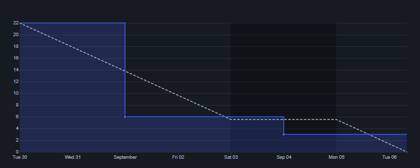
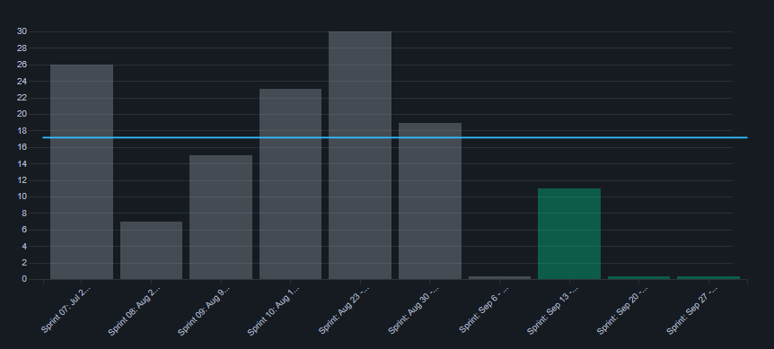

# Review

## 1. Visão Geral
<!-- data de inicio da sprint
     data de finalização da sprint
     duraração da sprint
 -->
Início | Fim | Duração
------ | --- | -------
30/08 | 06/09 | 7 dias

## 2. Conclusão
<!-- adicionar a issue, sua descrição, o responsavel e se a issue foi terminada ou não -->
Issues | Descrição | Responsáveis | Status
------ | --------- | ----------- | -------- 
01 | Documentar Sprint 12 | [Leonardo](https://github.com/kazpmcd) | Concluído
02 | Estilização do ranking | [João](https://github.com/JoaoSchmitz) | Concluído
03 | início testes do front | [Leonardo](https://github.com/kazpmcd) | Concluído
04 | Atualizar documentação | [Kallyne](https://github.com/kazpmcd/) | Concluído

## 3. FeedBack
<!--
Pontos positivos e negativos da Sprint
-->
### _Pontos Positivos_

* Reuniões ágeis.

### _Pontos de Melhoria_

* Comunicação com pouca frequência.

### _Pontos Negativos_

* * Algumas atividades inicialmente previstas não foram inclusas na sprint.

---------

## 4. Backlog do Produto
O Backlog do Produto pode ser visualizado neste [link](https://github.com/fga-eps-mds/2022-1-PokeRanking/blob/main/docs/Documenta%C3%A7%C3%A3o/product-backlog.md)

---------

## 5. Gráfico - BurnDown

---------

## 6. Gráfico - Velocity
